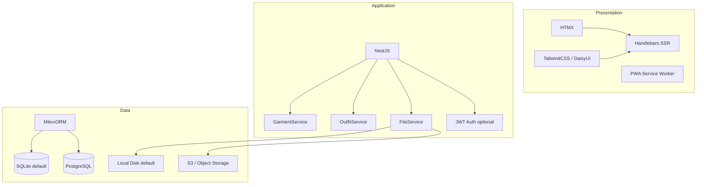
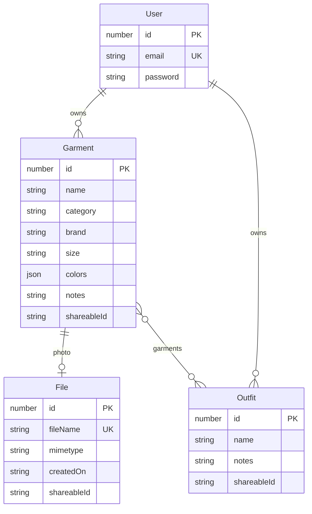

# Libre Closet

> Your wardrobe. Your data.

A free, open-source, self-hosted wardrobe organizer. Catalog your clothes, upload photos, build outfits, and access everything from your phone as an offline-ready PWA — all on your own server.

[](https://www.gnu.org/licenses/agpl-3.0)
[](https://github.com/lazztech/libre-closet/releases)

---

## Quick start

```bash
docker run -d \
  -p 3000:3000 \
  -v librecloset_data:/app/data \
  ghcr.io/lazztech/libre-closet
```

Open [http://localhost:3000](http://localhost:3000). No account required by default.

---

## Features

- **Garment catalog** — name, category, brand, size, colors, notes, photo
- **Outfit builder** — combine garments into saved looks
- **Photo uploads** — images auto-converted to optimized WebP
- **Offline-ready PWA** — install to home screen, works without internet
- **Optional auth** — run open for personal use or enable JWT accounts for multi-user
- **S3 or local storage** — local disk by default, swap to any S3-compatible provider
- **SQLite or PostgreSQL** — SQLite by default, PostgreSQL for scale

---

## Architecture





---

## Self-hosting

### Docker (recommended)

```bash
# SQLite + local storage (simplest)
docker run -d \
  -p 3000:3000 \
  -v librecloset_data:/app/data \
  -e APP_NAME="Libre Closet" \
  ghcr.io/lazztech/libre-closet
```

### docker-compose

```yaml
services:
  libre-closet:
    image: ghcr.io/lazztech/libre-closet
    ports:
      - "3000:3000"
    volumes:
      - librecloset_data:/app/data
    environment:
      APP_NAME: Libre Closet
      AUTH_ENABLED: "false"
      PWA_ENABLED: "true"
      DATA_PATH: /app/data
    restart: unless-stopped

volumes:
  librecloset_data:
```

### Build from source

```bash
git clone https://github.com/lazztech/libre-closet
cd libre-closet
cp .env .env.local     # override defaults locally (gitignored)
npm install
npm run start:prod
```

---

## Configuration

`.env` contains committed defaults. Override any value via a `.env.local` file (gitignored) or by passing real environment variables to Docker.

| Variable | Description | Default |
|---|---|---|
| `APP_NAME` | Display name shown in the UI and navbar | `Libre Closet` |
| `DATA_PATH` | Directory for SQLite DB and uploaded files | `./data` |
| `AUTH_ENABLED` | Enable JWT user accounts and login | `false` |
| `PWA_ENABLED` | Enable service worker and PWA install prompt | `false` |
| `ACCESS_TOKEN_SECRET` | JWT signing secret — **change for production** | `ChangeMe!` |
| `DATABASE_TYPE` | `sqlite` or `postgres` | `sqlite` |
| `DATABASE_HOST` | Postgres host | — |
| `DATABASE_PORT` | Postgres port | `5432` |
| `DATABASE_USER` | Postgres user | — |
| `DATABASE_PASS` | Postgres password | — |
| `DATABASE_SCHEMA` | Postgres schema | `postgres` |
| `DATABASE_SSL` | Use SSL for Postgres | `false` |
| `FILE_STORAGE_TYPE` | `local` or `object` (S3) | `local` |
| `OBJECT_STORAGE_ACCESS_KEY_ID` | S3 access key | — |
| `OBJECT_STORAGE_SECRET_ACCESS_KEY` | S3 secret key | — |
| `OBJECT_STORAGE_ENDPOINT` | S3-compatible endpoint URL | — |
| `EMAIL_FROM_ADDRESS` | From address for password reset emails | — |
| `EMAIL_TRANSPORT` | `gmail` or `mailgun` | `gmail` |
| `EMAIL_API_KEY` | Mailgun API key | — |
| `PUBLIC_VAPID_KEY` | Web push — generate for production | — |
| `PRIVATE_VAPID_KEY` | Web push — generate for production | — |

Generate VAPID keys:
```bash
npx web-push generate-vapid-keys
```

---

## Development

### Prerequisites

- Node (see `.nvmrc`) — install via [nvm](https://github.com/nvm-sh/nvm)
- Docker (optional, for Postgres testing)

```bash
nvm install && nvm use
npm install
cp .env .env.local     # override defaults locally (gitignored)
npm run start:dev
```

### Scripts

```bash
npm run start:dev       # watch mode
npm run start:prod      # production
npm run test            # unit tests
npm run test:e2e        # Playwright end-to-end
npm run test:cov        # coverage
npm run precommit       # lint + test + lighthouse (run before committing)
```

### Migrations

```bash
# SQLite (build first due to config differences)
npm run build
npx mikro-orm migration:create --config mikro-orm.sqlite.cli-config.ts

# PostgreSQL
npx mikro-orm migration:create --config mikro-orm.postgres.cli-config.ts
```

### Docker build

```bash
# Build image
docker build --no-cache -f docker/Dockerfile . -t libre-closet:latest

# Cross-compile for linux/amd64 (e.g. building on Apple Silicon for a VPS)
docker buildx build --platform linux/amd64 --no-cache -f docker/Dockerfile . -t libre-closet:latest
```

---

## Deployment recommendations

For most self-hosters: deploy to a VPS via [Coolify](https://coolify.io/) or Portainer using the docker-compose above with SQLite + local storage. SQLite handles thousands of users without issue — see [DjangoCon 2023: Use SQLite in Production](https://youtu.be/yTicYJDT1zE).

If you need horizontal scaling later, switch to S3-compatible storage and add [Litestream](https://litestream.io/) for streaming SQLite backups before considering a PostgreSQL migration.

---

## Contributing

PRs and issues are welcome. This project is licensed under AGPL-3.0 — contributions must be compatible with that license.

---

## License

[GNU AGPL-3.0](LICENSE)

---

## Built by

[Lazztech LLC](https://lazz.tech)


