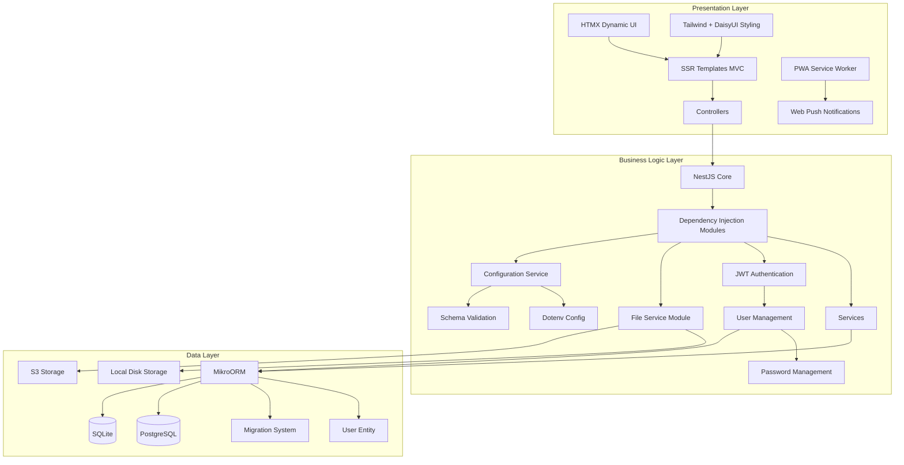
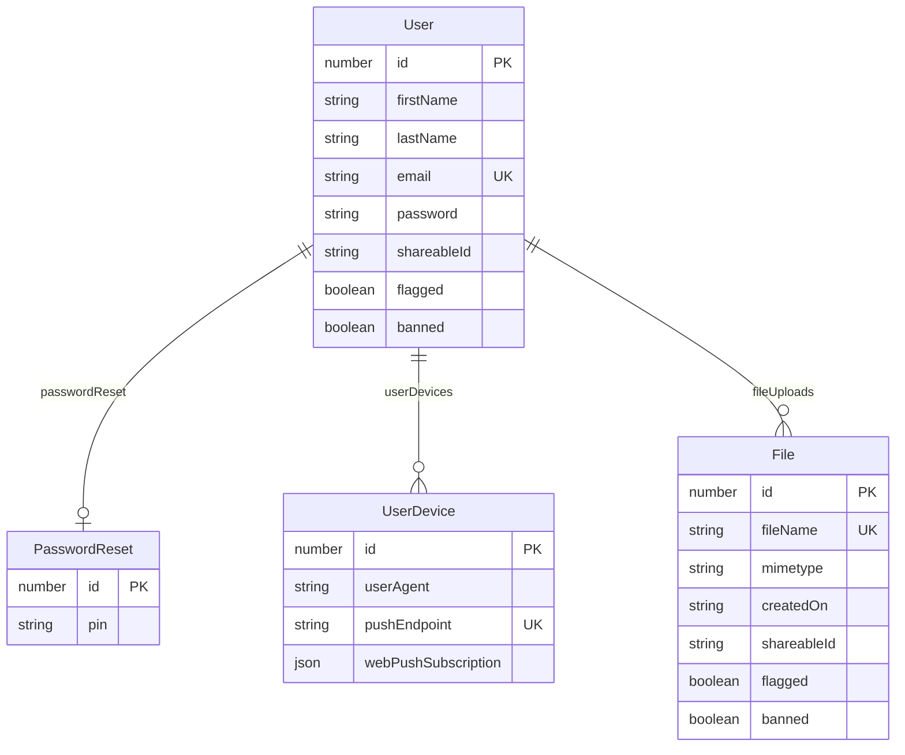

# Lazztech.Boilerplate

[](https://codespaces.new)

This repository serves as a jumping off point for rapid 3 tier web application development. It incorporates over a decade of software engineering, and extensive consulting experience, across various languages and frontend/backend web frameworks to propel project success. This boilerplate provides an established, opinionated, and proven platform to rapidly develop for many of the most common type of greenfield development efforts.

This boilerplate is architected with inspiration from, though not dogmatically following, the values spoken to in the speech [Building the Hundred-Year Web Service with htmx - Alexander Petros](https://www.youtube.com/watch?v=lASLZ9TgXyc)

- https://unplannedobsolescence.com/talks/building-the-hundred-year-web-service/



**Progressive Web App (PWA)**

This boilerplate is setup with PWA support out of the box. This includes an [installation prompt that works across platforms](https://github.com/khmyznikov/pwa-install) to guide the user to install the PWA as a traditional "App" on their devices. This works across all major platforms, desktop, and mobile. This project's service worker uses https://workboxjs.org. See the video below for a primer on PWAs and service workers with workbox.

[Fireship: Progressive Web Apps in 100 Seconds // Build a PWA from Scratch](https://www.youtube.com/watch?v=sFsRylCQblw)

The workbox generated service worker takes from the `workbox-config.js`, this takes from a `view/assets/src-sw.js` and outputs a generated `/public/js/sw.js`.

```bash
# generate a new sw.js after any changes to src-sw.js
$ npm run generate:sw
```

Also checkout the link below for some examples of what's possible with Progressive Web Apps modern web APIs.

https://whatpwacando.today/

**Google Lighthouse**

This all also results in a starting point for developing a web app with a perfect google lighthouse score.

https://developer.chrome.com/docs/lighthouse/overview

- Performance: 100%
- Accessibility: 100%
- Best Practices: 100%
- SEO: 100%

**It starts off from a freshly generated NestJS project which provides the following:**

- Boiler plate application inspired by Spring and Angular
  - Module based dependency injection
  - Example controller
  - Example service
  - Example jest unit test suite
  - Example e2e integration testing
  - Linting
  - Code Formatting
  - Logging
- CLI for generating controllers, services, tests, etc: https://docs.nestjs.com/cli/overview
- Pre-configured npm scripts

**From there support for the following is added:**

See the [diff between what this project adds to the default NestJS project](https://github.com/Lazztech/Lazztech.Boilerplate/compare/dedf27d0c01a9aaaae95ad4186814a111341eb77...main#diff) boilerplate.

- Dotenv configuration: https://docs.nestjs.com/techniques/configuration
- Environment variable configuration validation: https://docs.nestjs.com/techniques/configuration#schema-validation
- MVC Server Side Rendering: https://docs.nestjs.com/techniques/mvc
  - HTMX for dynamic UI interactions
  - Hyperscript for clientside UI interactions
  - Tailwind and DasyUI for styling
  - Manifest.json and JS Service Worker for Progressive Web App support
    - Support for Web Push Notifications: https://developer.mozilla.org/en-US/docs/Web/API/Push_API
- MikroOrm: https://docs.nestjs.com/recipes/mikroorm
  - Configuration based us of either Postgres or SQlite
  - Migrations
- A custom file service module
  - Configuration based us of either local disk or s3 based file storage
- Multi user support
  - User ORM entity
  - JWT Based Authentication: https://docs.nestjs.com/security/authentication
  - User password management and reset
- nest-i18n internationalization: https://nestjs-i18n.com/
- Open-Graph link previews: https://ogp.me/
- Dockerfile and Docker Compose script
- Github Actions Continuos Integration Pipeline
- Automated lighthouse performance testing: https://googlechrome.github.io/lighthouse-ci/
- VSCode Recommended Extensions

The following shows the included database entities that are used by the ORM to produce the following database table relations.



## How to use this boilerplate

1. Download the source as a zip, paste the contents into a new repository, commit and push
2. Add any project icons to `public/assets/`
3. Replace the `public/favicon.ico`
4. Adjust the `public/manifest.json` `short_name`, `name`, `description`, and `icons`, values (See [khmyznikov/pwa-install](https://github.com/khmyznikov/pwa-install) documentation for details on other options such as app screenshots)
5. Set the `.png` icon in the `views/layout.hbs` <link rel="apple-touch-icon" href="assets/lazztech_icon.png" /> element if you've added a png icon of a different name to `public/assets/`
6. Set the `APP_NAME` and `APP_ICON` variables in the `.env` file
7. Maintain your own i18n internationalization translations of `src/i18n/en/lang.json` in `src/i18n/[]`

**Deployment:**

The recommended path is to deploy to a vps of your choice via the provided `docker/Dockerfile` with something like [coolify](https://coolify.io/), with sqlite and local file storage, which are the defaults. If vertical scaling becomes a limiting factor, then you can use the s3 file storage and a tool like Litestream/LiteFS that allows for sqlite WAL (Write Ahead Logging) streaming backups and restoration via an s3 destination. If the project still then exceeds the capacity of sqlite then migrate to postgresql, but most likely YAGNI (You Aint Gonna Need It). For more about sqlite in production check out this talk [DjangoCon Europe 2023 | Use SQLite in production](https://youtu.be/yTicYJDT1zE).

Refer to details on configuring which database type and file storage type are below in the **Configuration** section.

Use a strong cryptographically random value for the `ACCESS_TOKEN_SECRET`.

Also Be sure to generate a new set of `PUBLIC_VAPID_KEY` and `PRIVATE_VAPID_KEY` configuration values for secure web-push functionality.

```bash
# generate public and private vapid keys
$ npx web-push generate-vapid-keys
```

## Development Dependencies

Development tools:

- Docker
- Node version manager
  - https://github.com/nvm-sh/nvm
  - Automatic NVM usage: https://github.com/nvm-sh/nvm?tab=readme-ov-file#deeper-shell-integration

```bash
# use nvm to install node from the .nvmrc file
$ nvm install
# set the in use node version from the .nvmrc file's verision
$ nvm use
# install node dependencies
$ npm install
```

## Running the app

```bash
# development
$ npm run start

# watch mode
$ npm run start:dev

# production mode
$ npm run start:prod
```

## Test

```bash
# unit tests
$ npm run test

# e2e tests
$ npm run test:e2e

# test coverage
$ npm run test:cov
```

## Docker

```bash
# Build and tag docker container
$ docker build --no-cache -f docker/Dockerfile . -t lazztech-boilerplate:latest

# Cross-compile build to a given target deployment platform
# Useful for building on ARM CPU development machines or for compiling for ARM on x86
$ docker buildx build --platform linux/amd64 --no-cache -f docker/Dockerfile . -t lazztech-boilerplate:latest

# Run the docker container from the built image
$ docker run -p 3000:3000 lazztech-boilerplate
```

## Postgres

A local instance of postgres running in a docker container for testing against a prod DB replica.
Pgadmin is not required, but recommend for ease of use. Alternatively the database-client VSCode extension may be used.

- https://marketplace.visualstudio.com/items?itemName=cweijan.vscode-database-client2

Create database dump and import to local database

```bash
# prepare gitignored data folder if it's not already present
$ mkdir ./data

# dump database
$ pg_dump -h <host> -p <port> -U <username> -Fc <database> > ./data/db.dump

# start postgres
$ docker run --name lazztech_postgres -e POSTGRES_USER=postgres -e POSTGRES_PASSWORD=Password123 -e POSTGRES_DB=postgres -p 5432:5432 postgres

# copy dump file to the docker container
$ docker cp ./data/db.dump lazztech_postgres:/var/lib/postgresql/data/db.dump

# shell into container
$ docker exec -it lazztech_postgres bash

# restore it from within
$ pg_restore -U postgres -d postgres --no-owner -1 /var/lib/postgresql/data/db.dump

# cleanup
$ docker stop lazztech_postgres
$ docker rm lazztech_postgres
```

In your .env or .env.local file configure these enviroment varaibles for postgres

```bash
# Postgres
DATABASE_TYPE=postgres
DATABASE_SCHEMA=postgres
DATABASE_HOST=localhost
DATABASE_PORT=5432
DATABASE_USER=postgres
DATABASE_PASS=Password123
DATABASE_SSL=false
```

```yml
# docker-compose.yml
version: '3.8'
services:
  db:
    container_name: lazztech_postgres
    image: postgres
    restart: always
    ports:
      - '5432:5432'
    environment:
      - POSTGRES_USER=postgres
      - POSTGRES_PASSWORD=Password123
      - POSTGRES_DB=postgres
    volumes:
      - /<Your_Volume_Directory>
  pgadmin:
    container_name: pgadmin4
    image: dpage/pgadmin4
    restart: always
    environment:
      - PGADMIN_DEFAULT_EMAIL=admin@admin.com
      - PGADMIN_DEFAULT_PASSWORD=root
    ports:
      - '5050:80'
```

## Migrations

Migrations are managed via the mikro-orm CLI.

Config values are available via the following:

```bash
# Note: due to configuration differences, run build before generating sqlite migrations!

# Create a Sqlite Migration
$ npx mikro-orm migration:create --config mikro-orm.sqlite.cli-config.ts

# Create a Postgresql Migration
$ npx mikro-orm migration:create --config mikro-orm.postgres.cli-config.ts
```

```bash
$ npx mikro-orm
Usage: mikro-orm <command> [options]

Commands:
  mikro-orm cache:clear             Clear metadata cache
  mikro-orm cache:generate          Generate metadata cache
  mikro-orm generate-entities       Generate entities based on current database
                                    schema
  mikro-orm database:create         Create your database if it does not exist
  mikro-orm database:import <file>  Imports the SQL file to the database
  mikro-orm seeder:run              Seed the database using the seeder class
  mikro-orm seeder:create <seeder>  Create a new seeder class
  mikro-orm schema:create           Create database schema based on current
                                    metadata
  mikro-orm schema:drop             Drop database schema based on current
                                    metadata
  mikro-orm schema:update           Update database schema based on current
                                    metadata
  mikro-orm schema:fresh            Drop and recreate database schema based on
                                    current metadata
  mikro-orm migration:create        Create new migration with current schema
                                    diff
  mikro-orm migration:up            Migrate up to the latest version
  mikro-orm migration:down          Migrate one step down
  mikro-orm migration:list          List all executed migrations
  mikro-orm migration:check         Check if migrations are needed. Useful for
                                    bash scripts.
  mikro-orm migration:pending       List all pending migrations
  mikro-orm migration:fresh         Clear the database and rerun all migrations
  mikro-orm debug                   Debug CLI configuration

Options:
      --config                  Set path to the ORM configuration file   [array]
      --contextName, --context  Set name of config to load out of the ORM
                                configuration file. Used when config file
                                exports an array or a function
                                                   [string] [default: "default"]
  -v, --version                 Show version number                    [boolean]
  -h, --help                    Show help                              [boolean]

Examples:
  mikro-orm schema:update --run  Runs schema synchronization
```

## Web Push Notifications

```bash
# generate public and private vapid keys
$ npx web-push generate-vapid-keys
```

## Scripts

```bash
# Helper script to run the primary pipeline steps locally before committing
$ npm run precommit
```

## Configuration

| Parameter                        | Function                                                     | Optional                                   | Example                                |
| -------------------------------- | ------------------------------------------------------------ | ------------------------------------------ | -------------------------------------- |
| APP_NAME                         | Used when sending emails to call out the name of the service | ❌                                         | Lazztech Boilerplate                   |
| AUTH_ENABLED                     | Enables or disables auth/login functionality                 | Defaults to false ✅                       | true or false                          |
| PWA_ENABLED                      | Enables or disables service worker & PWA install prompt      | Defaults to false ✅                       | true or false                          |
| ACCESS_TOKEN_SECRET              | Used for jwt tokens                                          | ⚠️ change for production                   | ChangeMe!                              |
| SITE_URL                         | Used for PWA icon URL                                        | ⚠️ change for production                   | https://mysite.com                     |
| PUBLIC_VAPID_KEY                 | Used for web push notifications                              | ⚠️ change for production                   |
| PRIVATE_VAPID_KEY                | Used for web push notifications                              | ⚠️ change for production                   |
| APP_ICON                         | Used for PWA icon, and watermark                             | Defaults to lazztech_icon.webp ✅          | lazztech_icon.webp                     |
| EMAIL_TRANSPORT                  | Used for emailing users                                      | ✅                                         | 'gmail' or 'mailgun' defaults to gmail |
| EMAIL_API_KEY                    | Used for emailing users                                      | required for mailgun                       |
| EMAIL_DOMAIN                     | Used for emailing users                                      | required for mailgun                       |
| EMAIL_FROM_ADDRESS               | Used for emailing users                                      | ❌                                         |
| EMAIL_PASSWORD                   | Used for emailing users                                      | ✅ when transport is mailgun               |
| DATABASE_TYPE                    | Used for selecting sqlite or postgres                        | Defaults to sqlite ✅                      | 'sqlite' or 'postgres'                 |
| DATABASE_HOST                    | Used for connecting to database                              | Optional depending on database type ✅     |
| DATABASE_PORT                    | Used for connecting to database                              | Optional depending on database type ✅     |
| DATABASE_USER                    | Used for connecting to database                              | Optional depending on database type ✅     |
| DATABASE_PASS                    | Used for connecting to database                              | Optional depending on database type ✅     |
| DATABASE_SCHEMA                  | Used for connecting to database                              | Optional depending on database type ✅     |
| DATABASE_SSL                     | To configure whether to use SSL for database                 | Optional depending on database type ✅     |
| FILE_STORAGE_TYPE                | For selecting local or S3 compatible storage configuration   | Defaults to local ✅                       | Select 'local' or 'object'             |
| OBJECT_STORAGE_ACCESS_KEY_ID     | Used for S3 compatible object file storage                   | Optional depending on file storage type ✅ |
| OBJECT_STORAGE_SECRET_ACCESS_KEY | Used for S3 compatible object file storage                   | Optional depending on file storage type ✅ |
| OBJECT_STORAGE_ENDPOINT          | Used for S3 compatible object file storage                   | Optional depending on file storage type ✅ |

## Lazztech LLC Cooperative Business Agreement

Each project contributor (“Contributor”) shall act as an independent contractor to Lazztech LLC (“Company”) and not as an employee, partner, or agent. Contributors are solely responsible for their own taxes, insurance, and legal compliance related to income earned through the Company. Payments shall be made to each eligible **Active Contributor** through a payment processor capable of issuing 1099 tax forms.

An **Active Contributor** is defined as any individual who has made at least one material contribution such as a code commit, pull request, documentation update, or other substantive input to a project that has been **approved by a current Active Contributor** and merged within the previous ninety (90) calendar days, measured from the date of their **last substantive contribution**.

Inactive or prospective contributors may regain/gain active status at any time by making a new contribution, reviewed and **approved by a majority of current Active Contributors**. Determinations of contributor activity and contribution history shall be verified through the project’s version control system or other mutually agreed-upon record keeping method.

Projects shall be licensed under the GNU Affero General Public License v3 (AGPLv3) to account for base code contribution agreement and a mutually assured open source commercial licensure, activated upon state changes and network use as a form of distribution, defined by the AGPLv3 license. Though additionally the source code of this project may be kept private or made public as determined by unanimous agreement of the project’s **Active Contributors**.

From there, 10% of each project’s revenue shall be allocated to Lazztech LLC. In exchange, Lazztech will provide this business agreement, and this boilerplate, along with hosting and deployment of resulting projects, up to a given fixed cost amount of $50 a month. The remaining 90% of a given project’s revenue shall be used to cover any additional hosting or project business expenses, as agreed upon by the projects **Active Contributors**, then split evenly to each Active Contributor of said project. This is **to ensure fairness of equity, alignment of incentive structure**, and to motivate for a cooperative lean contributor base, acting together in the best interests of a given projects **Active Contributors**.

If the project continues to generate revenue without requiring further maintenance, updates, or development, the **Active Contributors** may elect to pause the ninety-day count-down toward inactive status. This shall be documented in the docs/PROJECT_LOG.md, reviewed and approved unanimously by all **Active Contributors**. In this circumstance, contributors who made substantive contributions prior to that time shall **continue to receive their proportional share of revenue** in accordance with this agreement. This shall continue until the first unanimously reviewed, approved, and merged contribution. In which case the 90 day count-down will reset and resume for all **Active Contributors**.

This business agreement shall be maintained in all derivative projects distributed by Lazztech LLC and contributors. Contributions to the project shall be acknowledged as an agreement to these terms unless other licenses have been granted by Lazztech LLC and project contributors. Amendments may be made to this projects business agreement in the form of a PR, reviewed and approved by all of the given projects’ **Active Contributors**.

## License

GNU AGPLv3

---

Other licenses such as MIT may be offered at discretion of Lazztech LLC and or Active Contributors of this project.

## Stay in touch

- Website - [https://lazz.tech/](https://lazz.tech/)
