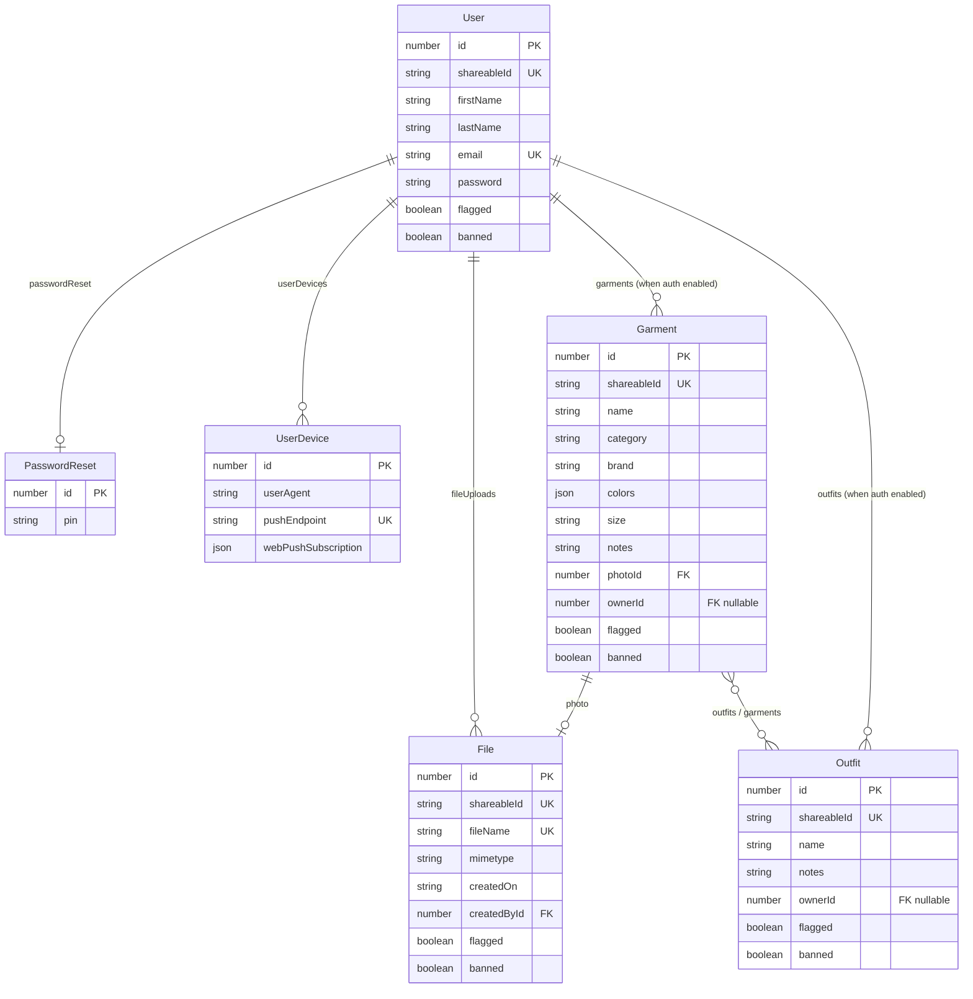

# Architecture Design Document

The inspiration here is for closet organization/management. This is predominantly oriented towards clothing, though may grow for other asset collection tracking.

Here are some similar products I was able to find in this space.

- https://github.com/benjaminjonard/koillection
- https://www.openwardrobe.co/
- https://www.myindyx.com/

---

## MVP Scope (v0.1)

The goal of v0.1 is the smallest usable, self-hostable release worth sharing publicly. It must be runnable via a single `docker run` command with zero configuration required.

### In Scope

| Feature                         | Description                                                                             |
| ------------------------------- | --------------------------------------------------------------------------------------- |
| **Garment cataloging**          | Upload a photo and fill in metadata: name, category, brand, color(s), size, notes       |
| **Garment list view**           | Filterable/searchable grid of all garments owned by the logged-in user                  |
| **Garment detail view**         | Full garment page with photo, all metadata, and edit/delete actions                     |
| **Outfit creation**             | Combine any number of owned garments into a named, saved outfit look                    |
| **Outfit list view**            | Grid of all saved outfits with their constituent garment thumbnails                     |
| **Outfit detail view**          | Full outfit page with garment breakdown and edit/delete actions                         |
| **Shareable public links**      | Per-garment and per-outfit public share URLs (leverages existing `shareableId` pattern) |
| **Multi-user support**          | Each user's wardrobe is private; existing auth + user model is sufficient               |
| **Self-hostable Docker deploy** | Works out of the box with SQLite + local file storage (zero-config defaults)            |
| **PWA install prompt**          | Mobile-first installable app experience (already provided by boilerplate)               |

### Explicitly Out of Scope for v0.1

- AI outfit suggestions
- Background removal / auto-tagging
- Outfit calendar / wear tracking
- Resale listing integration (Vinted, Depop)
- Stylist / B2B multi-client management
- Social feed / following other users
- Cost-per-wear analytics
- Packing list / capsule wardrobe builder

These are tracked as v0.2+ candidates. See [MARKET_ANALYSIS.md](MARKET_ANALYSIS.md) for prioritization rationale.

---

## Data Model

The following entities extend the existing boilerplate schema. Existing entities (`User`, `File`, `PasswordReset`, `UserDevice`, `ShareableId`) are unchanged.

### New Entities

#### `Garment`

Represents a single clothing item owned by a user.

| Field         | Type        | Notes                                                     |
| ------------- | ----------- | --------------------------------------------------------- |
| `id`          | `number` PK | Auto-increment                                            |
| `shareableId` | `string` UK | Inherited from `ShareableId`; used for public share URLs  |
| `name`        | `string`    | User-provided label, e.g. "Black Linen Blazer"            |
| `category`    | `enum`      | See `GarmentCategory` enum below                          |
| `brand`       | `string?`   | Optional brand name                                       |
| `colors`      | `string[]`  | One or more color labels                                  |
| `size`        | `string?`   | Free-text size (XS/S/M/L/XL or numeric)                   |
| `notes`       | `string?`   | Free-text notes                                           |
| `photo`       | `File` FK   | One-to-one relation to the existing `File` entity         |
| `owner`       | `User?` FK  | Many-to-one; nullable — omitted when `AUTH_ENABLED=false` |
| `outfits`     | `Outfit[]`  | Many-to-many back-reference                               |
| `flagged`     | `boolean?`  | Inherited from `ShareableId`                              |
| `banned`      | `boolean?`  | Inherited from `ShareableId`                              |

**`GarmentCategory` enum** (initial set, extensible):
`tops`, `bottoms`, `dresses`, `outerwear`, `footwear`, `accessories`, `bags`, `activewear`, `swimwear`, `underwear`, `other`

#### `Outfit`

Represents a saved combination of garments.

| Field         | Type        | Notes                                                     |
| ------------- | ----------- | --------------------------------------------------------- |
| `id`          | `number` PK | Auto-increment                                            |
| `shareableId` | `string` UK | Inherited from `ShareableId`; used for public share URLs  |
| `name`        | `string`    | User-provided label, e.g. "Summer Wedding Guest"          |
| `notes`       | `string?`   | Free-text notes or occasion context                       |
| `garments`    | `Garment[]` | Many-to-many; the garments that make up this outfit       |
| `owner`       | `User?` FK  | Many-to-one; nullable — omitted when `AUTH_ENABLED=false` |
| `flagged`     | `boolean?`  | Inherited from `ShareableId`                              |
| `banned`      | `boolean?`  | Inherited from `ShareableId`                              |

### Entity Relationship Diagram

---

## URL Structure

| Method   | Path                 | Description         |
| -------- | -------------------- | ------------------- |
| `GET`    | `/wardrobe`          | Garment list view   |
| `GET`    | `/wardrobe/new`      | New garment form    |
| `POST`   | `/wardrobe`          | Create garment      |
| `GET`    | `/wardrobe/:id`      | Garment detail view |
| `GET`    | `/wardrobe/:id/edit` | Edit garment form   |
| `POST`   | `/wardrobe/:id`      | Update garment      |
| `DELETE` | `/wardrobe/:id`      | Delete garment      |
| `GET`    | `/outfits`           | Outfit list view    |
| `GET`    | `/outfits/new`       | New outfit form     |
| `POST`   | `/outfits`           | Create outfit       |
| `GET`    | `/outfits/:id`       | Outfit detail view  |
| `GET`    | `/outfits/:id/edit`  | Edit outfit form    |
| `POST`   | `/outfits/:id`       | Update outfit       |
| `DELETE` | `/outfits/:id`       | Delete outfit       |

### Auth-Aware Behavior

The app respects the existing `AUTH_ENABLED` configuration flag:

| `AUTH_ENABLED` | List views (`/wardrobe`, `/outfits`)                | Owner assignment on create            | Edit / Delete guards                      |
| -------------- | --------------------------------------------------- | ------------------------------------- | ----------------------------------------- |
| `false`        | Show **all** garments / outfits in the database     | `owner` set to `null`                 | No ownership check — any visitor can edit |
| `true`         | Show only items belonging to the **logged-in user** | `owner` set to the authenticated user | Scoped to owner; 403 on mismatch          |

This means a single-user self-hoster can run with `AUTH_ENABLED=false` and get a zero-friction experience, while the hosted cloud deployment runs with `AUTH_ENABLED=true` to enforce per-user isolation.
| `GET` | `/share/garment/:shareableId` | Public garment share view |
| `GET` | `/share/outfit/:shareableId` | Public outfit share view (extends existing `/share` route) |

---

## Implementation Plan

### Phase 1 — Data Layer

1. Create `src/dal/entity/garment.entity.ts`
2. Create `src/dal/entity/outfit.entity.ts`
3. Add `garments` and `outfits` collections to `user.entity.ts`
4. Generate migrations for both SQLite and Postgres

### Phase 2 — Business Logic

5. Create `src/wardrobe/wardrobe.module.ts`
6. Create `src/wardrobe/garment.service.ts` (CRUD + file upload delegation)
7. Create `src/wardrobe/outfit.service.ts` (CRUD + garment association)

### Phase 3 — Views & Controllers

8. Create `src/wardrobe/wardrobe.controller.ts` (garment routes)
9. Create `src/wardrobe/outfit.controller.ts` (outfit routes)
10. Create Handlebars views: `views/wardrobe/index.hbs`, `views/wardrobe/show.hbs`, `views/wardrobe/form.hbs`
11. Create Handlebars views: `views/outfits/index.hbs`, `views/outfits/show.hbs`, `views/outfits/form.hbs`
12. Extend `views/share.hbs` to handle both garment and outfit share types

### Phase 4 — Polish & Release

13. Update navbar `views/partials/navbar.hbs` with Wardrobe and Outfits links
14. Update `public/manifest.json` with app name, icons, and description
15. Tag `v0.1.0` and post to r/selfhosted + slow-fashion communities
